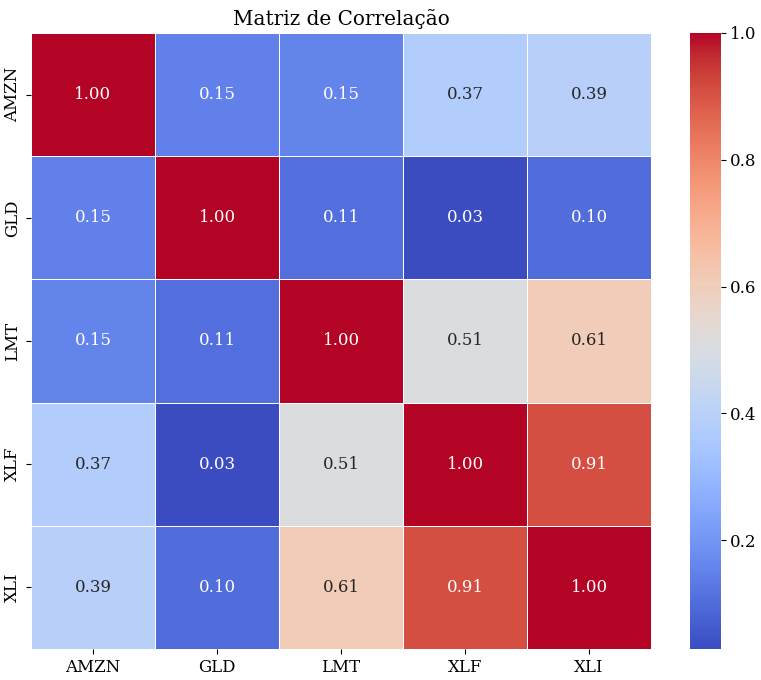
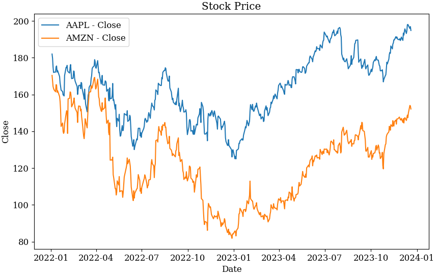
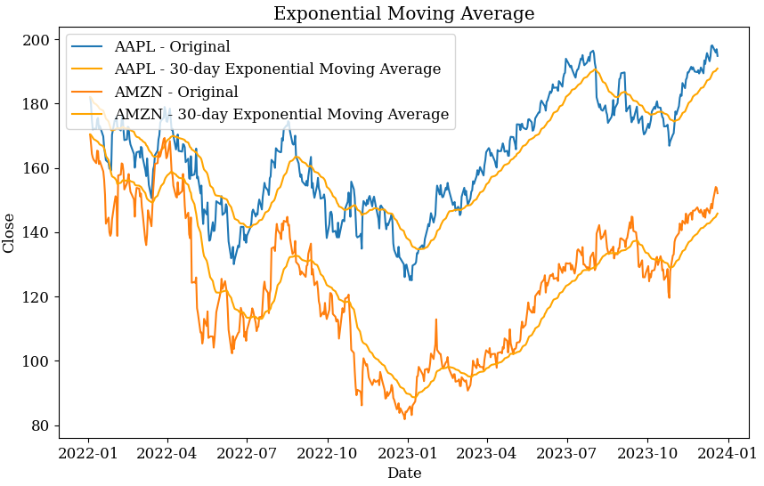
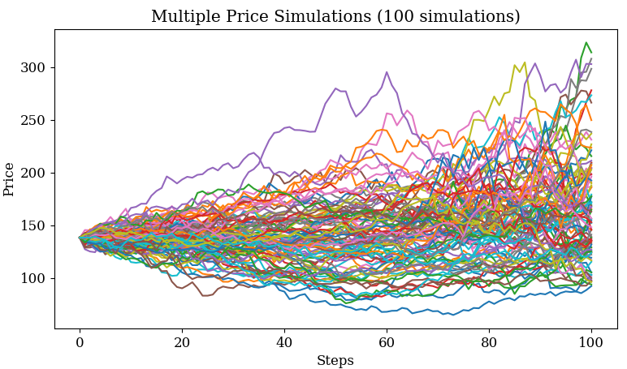
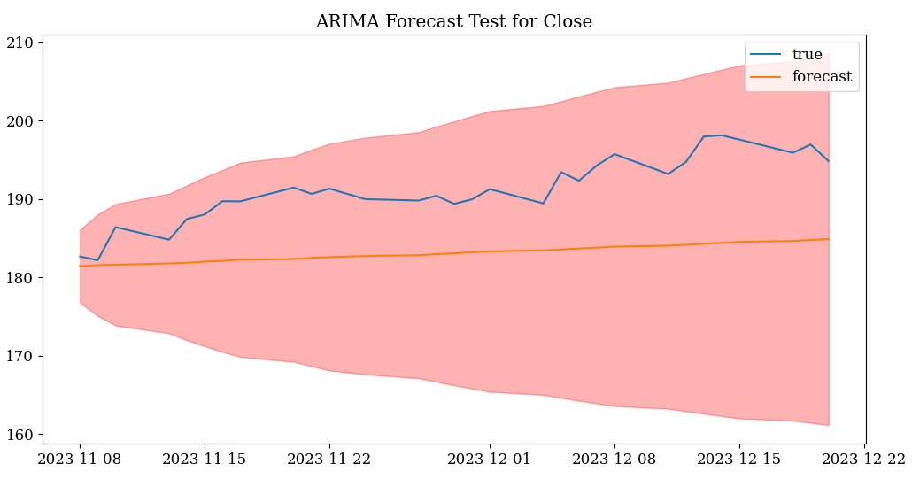

# ProjPythonStockPrices










## Descrição
Este projeto tem como objetivo desenvolver funcionalidades que utilizem dados de ações retirados e tratados da biblioteca
yfinance. Com isso, tem-se a ideia de através das series temporais a aplicação automatizada de modelos de simulação 
de preços utilizando uma abordagem de monte Carlo/ processos estocásticos por caminhos aleatórios e a utilização do modelo ARIMA de Machine Learning.

## Modelo estocástico empregado
Explicar o modelo estocástico que foi utilizado para simulação dos preços dos ativos
Modelo com adição de tendência 

## Modelo Arima 
Descrever como ele funciona. Por quais razões utiliza-se esse modelo para séries temporais
Método de achar os hiperparâmetros AIC

[Python-Forecast Book]: 

## Bibliotecas Necessárias

Certifique-se de ter as seguintes bibliotecas instaladas antes de executar o código:

- [seaborn](https://seaborn.pydata.org/)
- [prophet](https://facebook.github.io/prophet/)
- [yfinance](https://pypi.org/project/yfinance/)
- [pandas](https://pandas.pydata.org/)
- [numpy](https://numpy.org/)
- [matplotlib](https://matplotlib.org/)
- [pmdarima](https://pmdarima.readthedocs.io/)
- [statsmodels](https://www.statsmodels.org/)
- [scikit-learn](https://scikit-learn.org/)
- [scipy](https://www.scipy.org/)


# Explicação/Uso das classes, métodos e funções 

##  Módulo `data_utils`
Funções desse módulo:

### Função `stock_data`

#### Descrição
A função `stock_data` recebe o símbolo de ticker de uma ação e uma data de início (opcional) e retorna dados históricos dessa ação a partir da data especificada. Os dados incluem informações como preço de fechamento, retorno simples e retorno logarítmico.

#### Parâmetros
- `ticker` (str): Símbolo da ação para recuperar dados.
- `start_date` (str, padrão='2019-01-02'): Data de início para recuperar dados. Se não fornecida, a data padrão é '2019-01-02'.

#### Exemplo de Uso
```python

# Exemplo de uso
from data_utils import stock_data

ticker_symbol = 'AAPL'
start_date = '2022-01-01'
stock_data_aapl = stock_data(ticker_symbol, start_date)
print(stock_data_aapl.head())
```

### Função `skew_kurt`

#### Descrição:
A função skew_kurt calcula a assimetria (skewness) e a curtose (kurtosis) de um conjunto de dados. Pode operar em dois modos: 'standard', que utiliza os retornos brutos, e 'log', que utiliza os log-retornos.

#### Parâmetros

- `data` (DataFrame): O conjunto de dados contendo informações financeiras.
- `mode` (str, padrão='standard'): Modo de cálculo, podendo ser 'standard' para retornos brutos ou 'log' para log-retornos.

#### Retorno:
Uma lista contendo dois elementos: o primeiro é a skewness e o segundo é a kurtosis.

### Função `return_histogram`

#### Descrição:
A função `return_histogram gera um histograma dos retornos ou log-retornos de um conjunto de dados financeiros. Pode operar em dois modos: 'standard', que utiliza os retornos brutos, e 'log', que utiliza os log-retornos.

#### Parâmetros

- `data` (DataFrame): O conjunto de dados contendo informações financeiras.
- `scale` (str, padrão=None): Modo de escala para os dados, podendo ser 'log' para log-retornos.
- `bins` (int, padrão=100): Número de bins no histograma.
- `color` (str, padrão='blue'): Cor das barras do histograma.
- `edgecolor` (str, padrão='black'): Cor das bordas das barras do histograma.
- `alpha` (float, padrão=0.7): Transparência das barras do histograma.

#### Retorno : 
Um objeto de eixo (axis) do matplotlib contendo o histograma gerado.

####################################################################################################

##  Módulo `distributions`
Funções desse módulo:

### Função `return_distributions`

#### Descrição:
A função return_distributions gera dois gráficos para visualização da distribuição dos retornos ou log-retornos de um conjunto de dados financeiros. O primeiro gráfico mostra o histograma dos dados, com uma sobreposição da curva de ajuste (normal ou t-distribution). O segundo gráfico é o QQ-plot (Quantile-Quantile plot), que compara os quantis teóricos com os quantis observados, proporcionando uma visualização da adequação da distribuição escolhida.

#### Parâmetros
Alguns dos parâmetros tem origem da biblioteca matplotlib

- `data` (DataFrame): O conjunto de dados contendo informações financeiras.
- `distribution` (str, padrão='normal'): Tipo de distribuição a ser ajustada ('normal' ou 't-distribution').
- `mode` (str, padrão='standard'): Modo de cálculo, podendo ser 'standard' para retornos brutos ou 'log' para log-retornos.
- `bins` (int, padrão=100): Número de bins no histograma.
- `color` (str, padrão='blue'): Cor das barras do histograma.
- `edgecolor` (str, padrão='black'): Cor das bordas das barras do histograma.
- `alpha` (float, padrão=0.7): Transparência das barras do histograma.

#### Exemplo de uso
```python
from distributions import return_distributions
from data_utils import stock_data

# Carregar dados
googl = stock_data('GOOGL')

# Gerar gráficos de distribuição para retornos padrão
return_distributions(googl, distribution='normal', mode='standard')
```


##  Módulo `gaussian_mix`
Funções desse módulo:

### Função `MixtureModel`

#### Descrição:
A função MixtureModel gera um histograma dos retornos ou log-retornos de um conjunto de dados financeiros, junto com um modelo de mistura gaussiana que se ajusta aos dados. O modelo de mistura gaussiana é composto por dois componentes gaussianos. A função imprime os pesos, médias e variâncias dos componentes.

#### Parâmetros:

- `data` (DataFrame): O conjunto de dados contendo informações financeiras.
- `mode` (str, padrão='normal'): Modo de cálculo, podendo ser 'normal' para retornos brutos ou 'log' para log-retornos.
- `bins` (int, padrão=100): Número de bins no histograma.
- `color` (str, padrão='blue'): Cor das barras do histograma.
- `edgecolor` (str, padrão='black'): Cor das bordas das barras do histograma.
- `alpha` (float, padrão=0.7): Transparência das barras do histograma.

#### Retorno:
Um histograma com curva de ajuste do modelo de mistura gaussiana.

```python

from distributions import MixtureModel
from sua_biblioteca import stock_data

# Carregar dados
googl = stock_data('GOOGL')

# Gerar gráfico de modelo de mistura para retornos padrão
MixtureModel(googl, mode='normal')
```

# Classe `StockAnalyzer`

A classe `StockAnalyzer` é responsável por analisar e visualizar dados históricos de retornos de ações. Ela oferece funcionalidades para carregar dados, calcular retornos e gerar visualizações informativas.

## Métodos

### `__init__(self, stocks, start_date='2019-01-02')`

#### Descrição
Inicializa uma instância da classe `StockAnalyzer`.

#### Parâmetros
- `stocks` (lista): Lista de símbolos de ações a serem analisados.
- `start_date` (string, opcional): Data de início para análise. O padrão é '2019-01-02'.

### `stock_data(self, stock)`

#### Descrição
Carrega dados históricos de uma ação específica.

#### Parâmetros
- `stock` (string): Símbolo da ação a ser carregada.

#### Retorno
Um DataFrame contendo dados históricos da ação.

### `generate_returns_data(self, return_scale='normal')`

#### Descrição
Gera dados de retornos a partir dos dados históricos das ações.

#### Parâmetros
- `return_scale` (string, opcional): Escala dos retornos ('normal' ou 'log'). O padrão é 'normal'.

#### Retorno
Um DataFrame contendo os retornos das ações.

### `plot_correlation_matrix(self)`

#### Descrição
Plota a matriz de correlação entre os retornos das ações.

### `plot_pairplot(self)`

#### Descrição
Plota um pairplot dos retornos das ações.

### `plot_returns_over_time(self, separate_plots=False)`

#### Descrição
Plota os retornos das ações ao longo do tempo.

#### Parâmetros
- `separate_plots` (bool, opcional): Se verdadeiro, plota gráficos separados para cada ação. O padrão é falso.

## Exemplo de Uso

```python
from analytics import StockAnalyzer

# Criar uma instância de StockAnalyzer
analyzer = StockAnalyzer(['AAPL', 'GOOGL'], start_date='2020-01-01')

# Plotar matriz de correlação
analyzer.plot_correlation_matrix()

# Plotar pairplot
analyzer.plot_pairplot()

# Plotar retornos ao longo do tempo
analyzer.plot_returns_over_time(separate_plots=True)
```

# Função `PriceSimulationFunc`

A função `PriceSimulationFunc` realiza uma simulação estocástica de preços com base na distribuição dos retornos das ações. A simulação pode ser realizada usando uma distribuição de Mixture of Gaussians ou uma distribuição t.

## Parâmetros
- `data` (DataFrame): DataFrame contendo os dados históricos de preços.
- `steps` (int, opcional): O número de etapas para a simulação. O padrão é 10.
- `distribution` (str, opcional): A distribuição a ser utilizada ('MixGaussians' ou 't-distribution'). O padrão é 'MixGaussians'.

## Exemplo de Uso

```python
from price_simulation import PriceSimulationFunc
from data_utils import stock_data

# Carregar dados
googl = stock_data('GOOGL')

# Executar simulação de preços com distribuição de Mixture of Gaussians
PriceSimulationFunc(googl, steps=20, distribution='MixGaussians')
```

# Classe `StockPlotter`

A classe `StockPlotter` é uma ferramenta para visualização de dados históricos de preços de ações, proporcionando facilidade na criação de gráficos informativos e análises visuais.

## Métodos

### Método `__init__(self, ticker, start_date='2022-01-01', end_date=None)`

- **Parâmetros**
  - `ticker` (str): Símbolo da ação a ser analisada.
  - `start_date` (str, opcional): Data de início para a coleta de dados. O padrão é '2022-01-01'.
  - `end_date` (str, opcional): Data de término para a coleta de dados. Se não fornecida, será utilizada a data atual.

### Método `get_stock_data(self)`

Este método utiliza a biblioteca Yahoo Finance para baixar dados históricos de preços da ação especificada.

### Método `plot_stock(self, column='Close', title='Stock Price', figsize=(10, 6))`

Este método gera um gráfico de linha para o preço da ação ao longo do tempo.

- **Parâmetros**
  - `column` (str, opcional): Coluna a ser plotada. O padrão é 'Close'.
  - `title` (str, opcional): Título do gráfico. O padrão é 'Stock Price'.
  - `figsize` (tuple, opcional): Tamanho da figura. O padrão é (10, 6).

### Método `plot_multiple_stocks(self, columns=['Close'], title='Stock Prices', figsize=(10, 6))`

Este método gera um gráfico de linha para vários preços de ações ao longo do tempo.

- **Parâmetros**
  - `columns` (list, opcional): Lista de colunas a serem plotadas. O padrão é ['Close'].
  - `title` (str, opcional): Título do gráfico. O padrão é 'Stock Prices'.
  - `figsize` (tuple, opcional): Tamanho da figura. O padrão é (10, 6).

### Método `plot_moving_average(self, column='Close', window=20, title='Moving Average', figsize=(10, 6))`

Este método gera um gráfico com a média móvel de uma determinada coluna ao longo do tempo.

- **Parâmetros**
  - `column` (str, opcional): Coluna a ser utilizada para a média móvel. O padrão é 'Close'.
  - `window` (int, opcional): Janela para o cálculo da média móvel. O padrão é 20.
  - `title` (str, opcional): Título do gráfico. O padrão é 'Moving Average'.
  - `figsize` (tuple, opcional): Tamanho da figura. O padrão é (10, 6).

### Método `plot_bollinger_bands(self, column='Close', window=20, num_std=2, title='Bollinger Bands', figsize=(10, 6))`

Este método gera um gráfico com as bandas de Bollinger para a ação especificada.

- **Parâmetros**
  - `column` (str, opcional): Coluna a ser utilizada para as bandas de Bollinger. O padrão é 'Close'.
  - `window` (int, opcional): Janela para o cálculo das bandas de Bollinger. O padrão é 20.
  - `num_std` (float, opcional): Número de desvios padrão para a construção das bandas. O padrão é 2.
  - `title` (str, opcional): Título do gráfico. O padrão é 'Bollinger Bands'.
  - `figsize` (tuple, opcional): Tamanho da figura. O padrão é (10, 6).

### Método `plot_exponential_moving_average(self, column='Close', span=20, title='Exponential Moving Average', figsize=(10, 6))`

Este método gera um gráfico com a média móvel exponencial de uma determinada coluna ao longo do tempo.

- **Parâmetros**
  - `column` (str, opcional): Coluna a ser utilizada para a média móvel exponencial. O padrão é 'Close'.
  - `span` (int, opcional): Parâmetro de suavização para o cálculo da média móvel exponencial. O padrão é 20.
  - `title` (str, opcional): Título do gráfico. O padrão é 'Exponential Moving Average'.
  - `figsize` (tuple, opcional): Tamanho da figura. O padrão é (10, 6).

### Exemplo de Uso da Classe `StockPlotter`

Para utilizar a classe `StockPlotter`, primeiro, instancie um objeto da classe com o símbolo da ação desejada:

```python
from plotter.py import StockPlotter

# Criar uma instância do StockPlotter para a ação 'AAPL' com início em '2022-01-01'
plotter_aapl = StockPlotter(ticker='AAPL', start_date='2022-01-01')

# Plotar o preço de fechamento da ação ao longo do tempo
plotter_aapl.plot_stock(column='Close', title='AAPL Stock Price Over Time', figsize=(12, 8))

# Plotar os preços de fechamento e abertura da ação ao longo do tempo
plotter_aapl.plot_multiple_stocks(columns=['Close', 'Open'], title='AAPL Closing and Opening Prices Over Time', figsize=(12, 8))

# Plotar a média móvel de 20 dias do preço de fechamento da ação
plotter_aapl.plot_moving_average(column='Close', window=20, title='AAPL 20-Day Moving Average', figsize=(12, 8))

# Plotar as bandas de Bollinger para o preço de fechamento da ação
plotter_aapl.plot_bollinger_bands(column='Close', window=20, num_std=2, title='AAPL Bollinger Bands', figsize=(12, 8))

# Plotar a média móvel exponencial de 20 dias do preço de fechamento da ação
plotter_aapl.plot_exponential_moving_average(column='Close', span=20, title='AAPL 20-Day Exponential Moving Average', figsize=(12, 8))

```


## Função `PriceSimulationFunc_trend`

### Descrição
Esta função realiza uma simulação de preço com tendência ascendente ou descendente, usando uma distribuição de mistura de gaussianas ou uma distribuição t. A função aceita dados históricos de preços, como um DataFrame do pandas.

### Parâmetros

- `data` (DataFrame): O DataFrame contendo os dados históricos de preços.
- `steps` (int): O número de etapas para simulação.
- `num_simulations` (int): O número de simulações a serem executadas.
- `distribution` (str): A distribuição a ser usada ('MixGaussians' ou 't-distribution').
- `trend` (str): A tendência dos preços ('up', 'down' ou 'none').
- `trend_strength` (float): A força da tendência.

### Exemplo de Uso

```python
from stats_time_series import PriceSimulationFunc_trend
from sua_biblioteca import stock_data

# Carregar dados
googl = stock_data('GOOGL')

# Executar a simulação de preço com tendência ascendente
PriceSimulationFunc_trend(googl, steps=100, num_simulations=8, distribution='MixGaussians', trend='up', trend_strength=0.1)
```

# Classe `ARIMAPredictor`

A classe `ARIMAPredictor` é projetada para realizar previsões usando o modelo ARIMA (AutoRegressive Integrated Moving Average) em séries temporais financeiras. O ARIMA é um modelo estatístico que incorpora componentes autoregressivos, integrativos e de média móvel para modelar padrões temporais em dados.

## Métodos

### Método `__init__(self, data, column='Close', n_test=30)`

O método de inicialização recebe os dados temporais (`data`), o nome da coluna a ser utilizada (`column` - padrão é 'Close') e o número de pontos de teste (`n_test` - padrão é 30).

### Método `split_data(self)`

Divide os dados em conjuntos de treinamento e teste, onde os últimos `n_test` pontos são utilizados para avaliação do modelo.

### Método `fit_model(self)`

Ajusta um modelo ARIMA aos dados de treinamento utilizando a biblioteca `pmdarima` para encontrar automaticamente os melhores parâmetros do modelo.

### Método `plot_result(self, model)`

Plota o ajuste do modelo nos dados de treinamento, a previsão nos dados de teste e a faixa de confiança.

### Método `plot_test(self, model)`

Plota a previsão do modelo nos dados de teste junto com a faixa de confiança.

### Método `extrapolate_test(self, model, future_steps=10)`

Realiza uma extrapolação do modelo para `future_steps` pontos adicionais além dos dados de teste, exibindo a previsão e a faixa de confiança.

## Exemplo de Uso

```python
from arima_forecast import ARIMAPredictor
from data_utils import stock_data

aapl = stock_data('AAPL')
aapl['Date'] = pd.to_datetime(aapl['Date'])
aapl.set_index('Date', inplace=True)
aapl = aapl.dropna()
aapl_predictor = ARIMAPredictor(aapl, column='Close')
close_model = aapl_predictor.fit_model()
aapl_predictor.plot_result(close_model)
aapl_predictor.plot_test(close_model)
aapl_predictor.extrapolate_test(close_model,future_steps =100)
```


# 
#
#
#
#
